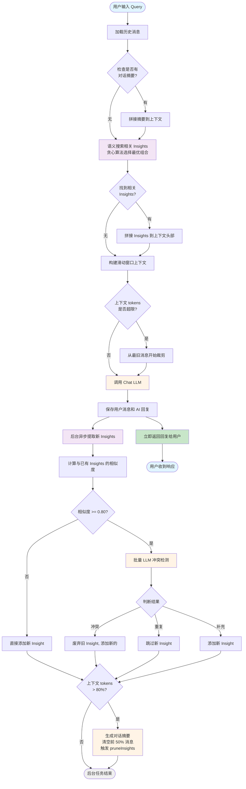

# backlog

## 基础功能：短期记忆和长期记忆

- 短期记忆：使用滑动窗口实现，将最近的、tokens 总和在最大上下文内的 n 条对话拼接在 prompt 内
- 长期记忆：摘要和 insight 实现
  - 记忆总结：摘要
    - 摘要：使用 tokenizer 控制 token 数，如果超过 token 数则生成摘要，然后清空现有滑动窗口里面的对话，将摘要拼接在 prompt 内
    - 可复用知识策略（Insights / Dynamic Cheatsheet）：实现论文 "Test-Time Learning with Adaptive Memory" 中的策展机制，从对话中智能提取、管理和检索可复用的知识。
      
      **提取机制**：每次用户发送消息并获得回复后，自动调用 Curator 模型分析最近的对话内容（保留最后 20 条消息作为上下文），提取可复用的知识（策略、代码、决策、概念、方法）。只提取重要性 > 0.5 的高质量知识，并对每条知识生成 Embedding 向量用于后续检索。
      
      **去重与冲突检测**：采用两阶段智能检测机制，大幅降低 API 调用。第一阶段使用 Embedding 计算新知识与所有已有同类型知识的余弦相似度，筛选出所有 ≥ 0.80 的高相似项。如果没有高相似项则直接添加；如果有则进入第二阶段批量检测队列。第二阶段对队列中的所有新知识进行一次性批量 LLM 调用，让 LLM 判断每条新知识与其高相似知识（取 Top-K）的关系：如果是冲突则用新策略替换旧策略，如果是重复则跳过新的，如果是补充则共存。Top-K 采用动态对数增长函数 `k = 3 + floor(log₁₀(n + 1))`，其中 n 为已有同类型 Insights 数量。这样既保证了检测的全面性（考虑多个候选），又避免了信息过载（只发送真正相似的给 LLM），同时控制了开销（对数增长）。无论一次提取多少条新知识，冲突检测最多只需 1 次 LLM 调用。
      
      **Top-K 动态增长表**（k = 3 + floor(log₁₀(n + 1))）：
      
      | 已有 Insights 数量 (n) | Top-K 值 | 说明 |
      |------------------------|----------|------|
      | 0 ~ 9 | 3 | 初始阶段，检查 3 个最相似项 |
      | 10 ~ 99 | 4 | 小规模知识库 |
      | 100 ~ 999 | 5 | 中等规模知识库 |
      | 1,000 ~ 9,999 | 6 | 大规模知识库 |
      | 10,000 ~ 99,999 | 7 | 超大规模知识库 |
      | 100,000 ~ 999,999 | 8 | 海量知识库 |
      
      **检索机制**：每次用户发送新消息时，使用语义搜索从数据库中检索相关知识。通过 Embedding 计算查询与所有知识的余弦相似度，结合重要性和时效性（最近 7 天满分，7-30 天线性衰减至 0.5，30-90 天衰减至 0.2）计算综合得分（相似度 60% + 重要性 40%）。将所有 Insights 按综合得分从高到低排序后，采用贪心算法逐个添加：从得分最高的 Insight 开始，只要累计 token 数不超过预算（maxInsightsTokens，默认 3000 tokens），就继续添加下一个，直到无法再装入为止。这样既保证了检索质量（优先选择最相关的），又充分利用了 token 预算（自动适配 Insight 大小），数量完全由实际内容动态决定。检索到的知识格式化后拼接在 prompt 的开头部分。
      
      **维护机制**：实现自动清理策略，在生成对话摘要时触发 pruneInsights，清理低重要性（< 0.5）且长期未使用（reuse_count = 0）的知识，以及已废弃超过 30 天的知识（is_deprecated = 1）。通过 deprecateInsight 标记冲突或被更好版本替代的旧知识，而不是直接删除，保留审计轨迹。所有知识独立存储于每个对话的 insights 表中，确保对话间的知识隔离。
- 输入输出流程：

**流程说明**：当用户发送消息后，系统首先检查是否存在对话摘要并拼接到上下文，然后通过语义搜索检索相关的 Insights。检索采用贪心算法：将所有 Insights 按综合得分（相似度 50% + 重要性 30% + 时效性 20%）排序后，从得分最高的开始逐个添加，直到累计 token 数达到 3000 预算为止，数量完全由实际内容大小动态决定。检索到的知识拼接到上下文头部后，从数据库加载滑动窗口内的历史消息，确保总 token 数不超过限制（80000）。构建好上下文后调用 Chat LLM 生成回复，保存消息到数据库，**立即返回给用户**（用户体验优先）。同时在后台异步提取新 Insights（不阻塞响应）：使用 Embedding 计算新知识与已有同类型知识的相似度，筛选出所有 ≥ 0.80 的高相似项，若无高相似项则直接添加，若有则取 min(高相似项数量, Top-K) 个通过批量 LLM 调用判断是冲突、重复还是补充，最多只需 1 次 LLM 调用且只发送真正相似的知识给 LLM（避免低相似度噪音干扰，节省 token）。后台还会检查上下文是否达到 80% 阈值，若是则生成摘要、清空前 50% 消息并触发 Insights 清理，确保记忆系统的健康运行。

## 额外功能：