```mermaid
graph TB
    A[角色工厂] --> B{创建方式}
    B --> C[加载已保存角色]
    B --> D[上传聊天记录]
    B --> E[手动创建]
    
    C --> F[角色对象]
    D --> G[建造者] --> F
    E --> F
    
    style A fill:#e67e22
    style F fill:#2ecc71
```

# 设计模式

本项目采用以下核心设计模式来实现记忆功能和角色模拟系统。

## 1. 策略模式 (Strategy Pattern)

### 用途
管理多种记忆实现方案，可以动态切换不同的记忆策略。

### 应用场景
- 滑动窗口记忆策略
- RAG检索增强策略
- Cheatsheet摘要策略
- 可以根据对话场景动态选择最适合的记忆方案

### 架构图

### 核心思想
将不同的记忆算法封装成独立的策略类，使得可以在运行时根据需求切换记忆方案，而不需要修改核心代码。

---

## 2. 状态模式 (State Pattern)

### 用途
实现情绪状态机，管理角色的情绪状态及其转换。

### 应用场景
- 高兴、生气、悲伤、焦虑、平静等多种情绪状态
- 情绪影响回复方式和语气
- 情绪的自然转换（不会突然从生气变开心）
- 情绪延续性管理

### 架构图

### 核心思想
将每种情绪封装为独立的状态类，每个状态有自己的行为（如何回复、如何转换）。情绪变化时切换状态对象，保证情绪转换的合理性和延续性。

---

## 3. 外观模式 (Facade Pattern)

### 用途
简化Ruby和Python服务之间的复杂通信，提供统一简洁的调用接口。

### 应用场景
- 封装Python向量搜索调用
- 封装Embeddings生成调用
- 隐藏跨语言通信的技术细节
- 统一错误处理和数据格式转换

### 架构图

### 核心思想
将复杂的跨语言调用、JSON解析、错误处理等细节封装在外观类中，Electron主进程只需要调用简单的方法，不需要关心底层实现细节。

---

## 模式协作关系

## 4. 命令模式 (Command Pattern)

### 用途
实现测试和运行模式的自动注册与选择机制，支持可扩展的功能管理。

### 应用场景
- 测试管理：新增测试自动注册，用户选择执行
- 运行模式管理：问答模式、聊天模式等自动注册
- 支持批量执行和历史记录

### 架构图

### 核心思想
将每个测试和运行模式封装为命令对象，通过继承基类自动注册到注册表，运行时动态选择执行，无需修改主程序代码。

---

## 5. 建造者模式 (Builder Pattern)

### 用途
从聊天记录分析创建复杂的角色对象，支持步骤化构建和调整。

### 应用场景
- 分析聊天记录提取角色特征
- 步骤化配置角色参数
- 支持用户手动调整和确认
- 生成完整的角色配置

### 架构图

### 核心思想
将复杂的角色创建过程分解为多个步骤，每个步骤独立处理一个方面的特征，最后组装成完整的角色对象，支持灵活调整。

---

## 6. 工厂模式 (Factory Pattern)

### 用途
根据不同来源创建角色实例，统一角色创建接口。

### 应用场景
- 从保存的配置文件加载角色
- 从上传的聊天记录创建角色
- 手动创建角色
- 克隆已有角色

### 架构图

### 核心思想
封装角色创建的复杂逻辑，提供统一的创建接口，客户端无需关心角色的具体创建过程。

---

## 模式协作关系

## 总结

系统采用六种设计模式的组合：

### 核心功能模式
- **策略模式**：灵活的记忆方案切换
- **状态模式**：真实的情绪状态机
- **外观模式**：简化跨语言通信

### 可扩展性模式
- **命令模式**：自动注册的测试和模式管理
- **建造者模式**：复杂角色的步骤化构建
- **工厂模式**：统一的角色创建接口

通过这些模式的组合使用，系统既保持核心功能的灵活性，又支持良好的可扩展性。
