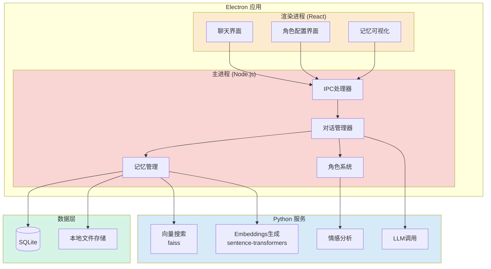

# 系统架构设计

## 整体架构

## 技术栈职责划分

### Electron 主进程 (TypeScript/Node.js) 负责
- **对话流程控制**：管理对话状态和上下文
- **角色系统**：人格参数、知识边界、情绪状态管理
- **记忆管理策略**：决定什么存储、什么检索、什么遗忘
- **数据持久化**：SQLite数据库操作
- **Python服务调用**：通过HTTP/子进程与Python通信
- **业务逻辑**：整合各个模块

### Electron 渲染进程 (React + TypeScript) 负责
- **用户界面**：现代化的GUI聊天界面
- **角色配置**：可视化的角色参数设置
- **记忆展示**：记忆内容的可视化展示
- **状态管理**：前端状态管理（React状态/上下文）
- **与主进程通信**：通过IPC通信

### Python 服务 负责
- **向量搜索**：使用faiss进行语义相似度搜索
- **Embeddings生成**：使用sentence-transformers生成文本向量
- **情感分析**：分析对话情绪（可选）
- **LLM API调用**：与OpenAI/Claude通信
- **HTTP API服务**：提供RESTful API接口

### 数据层
- **SQLite**：存储结构化记忆（对话历史、角色设定）
- **本地文件存储**：角色配置文件、向量索引文件

## 通信方式

- **渲染进程 <-> 主进程**：Electron IPC (ipcRenderer/ipcMain)
- **主进程 <-> Python服务**：HTTP请求 或 子进程通信
- **主进程 <-> 数据层**：better-sqlite3 / node-sqlite3
