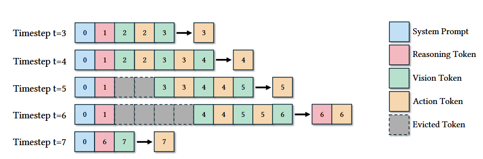

# 项目作业：大语言模型记忆功能的设计与实现

## 一、项目背景

### 1.1 核心问题：LLM的无状态特性

大语言模型（Large Language Models, LLMs）在当前的人工智能应用中展现出强大的能力，但它们**本质上是无状态的系统**。

#### 无状态系统的特征

1. **独立响应**：每次接收到prompt时，模型都会独立生成回复
2. **无历史上下文**：不会自动参考用户的历史对话内容
3. **无记忆能力**：无法记住用户表达过的偏好、背景信息或历史交互
4. **缺乏持续学习**：缺乏上下文积累和从错误中学习的能力

### 1.2 无状态特性导致的实际问题

这种无状态特性在实际应用中带来以下限制：

- **重复性问题**：用户需要在每次对话中重复提供相同的背景信息
- **无法个性化**：模型无法根据用户的历史行为进行个性化响应
- **重复犯错**：模型之前犯过的错，如果反馈没有加入记忆，下一次还是会重复犯错

### 1.3 现有的记忆解决方案

目前有多种方法试图为大语言模型添加记忆模块：

#### 1.3.1 主流记忆方案

1. **历史消息拼接**
   - 方法：将历史消息直接拼接到提示词中
   - 优点：实现简单，效果直接
   - 缺点：上下文长度受限

2. **检索增强生成（RAG）**
   - 方法：从外部知识库检索相关信息
   - 优点：可扩展性强
   - 缺点：依赖检索质量

3. **Cheatsheet方法**
   - 参考文献：[Dynamic Cheatsheet: Test-Time Learning with Adaptive Memory](../resources/private/papers/Test-Time%20Learning%20with%20Adaptive%20Memory.pdf)
   - 方法：动态维护关键信息摘要

4. **新模型架构**
   - 参考文献：[Titans: Learning to Memorize at Test Time](../resources/private/papers/Learning%20to%20Memorize%20at%20Test%20Time.pdf)
   - 方法：在模型架构层面支持记忆功能

#### 1.3.2 基于上下文记忆的挑战

基于上下文的记忆模式面临以下问题：

- **性能问题**：记忆信息太多时，会影响模型的推理速度
- **噪声干扰**：可能引入无关信息，影响当前对话质量
- **容量限制**：上下文窗口有最大长度限制

### 1.4 滑动窗口机制

为了解决上下文容量问题，**上下文滑动窗口**是一种常用的记忆管理方式：

#### 滑动窗口工作原理

- **窗口起始**：系统提示词 + 上一次的思考token
  - 这两部分引导接下来的Image-action对生成

- **窗口内容**：Image-action对序列

- **窗口大小控制**：设置阈值（threshold）
  - 当Image-action对数量超过threshold时
  - 移除最前面的内容
  - 保留最近生成的内容（FIFO原则，先进先出）

- **思考token更新**：
  - 遇到下一次思考时，替换上一次的思考token

- **效果**：维持一个固定大小为threshold的滑动窗口，作为上下文记忆

#### 滑动窗口的优缺点

**优点**：
- 控制上下文长度，避免超出模型限制
- 保留最近的相关信息

**缺点**：
- 旧的记忆会被丢弃
- 无法保留长期重要信息

## 二、实施步骤

按照以下步骤开展研究：

### 2.1 理论研究阶段

#### 步骤1：理解记忆功能的重要性与挑战

**研究问题**：
- 为什么大语言模型需要记忆功能？
- 记忆功能在实际应用中解决了哪些问题？
- 记忆模块的设计和实现面临哪些挑战？

**关键挑战包括**：
- 如何高效存储和检索记忆
- 如何平衡记忆容量和响应速度
- 如何避免记忆冲突和幻觉
- 如何实现记忆的遗忘和更新

#### 步骤2：调研主流记忆实现方案

**调研内容**：

1. **分类研究**：
   - 这些方案分别是基于什么原理的？
   - 可以分为哪几大类？
   - 每类方案的核心思想是什么？

2. **对比分析**：
   - 不同记忆机制的优势和劣势
   - 各方案的适用场景
   - 性能和成本的权衡

3. **文献阅读**：
   - 参考提供的论文和现有文献
   - 了解最新的研究进展

### 2.2 设计与实现阶段

#### 步骤3：设计并实现集成记忆功能的LLM/Agent

**实现内容**：
- 设计记忆模块的整体架构
- 选择合适的记忆方案（或组合多种方案）
- 实现核心功能：
  - 记忆的存储
  - 记忆的检索
  - 记忆的更新
  - 记忆的遗忘
- 集成到LLM/Agent系统中

### 2.3 评估与分析阶段

#### 步骤4：评估记忆模块性能

**评估方法**：
- 设计对比实验，比较你的实现与其他记忆机制的差异
- 评估指标可以参考现有文献
- 建议评估的维度：
  - 记忆准确性
  - 检索速度
  - 对话质量
  - 长期记忆保持能力

#### 步骤5：结果分析与总结

**分析工作**：

1. **可视化分析**：
   - 推荐使用wandb等可视化分析工具
   - 展示实验数据和趋势

2. **深入分析**：
   - 分析结果产生的原因
   - 必要时设计消融实验，验证各模块的作用

3. **失败记录**：
   - **鼓励大胆尝试**
   - 实验结果不是SOTA没关系
   - **重点是分析**：为什么某些方法有效/无效
   - 可以记录失败的尝试，这也是有价值的研究成果

**输出内容**：
- 实验报告
- 性能对比图表
- 问题分析和改进建议
- 经验总结

## 三、额外功能

### 3.1 核心功能要求

#### 3.1.1 角色扮演与关系还原
**目标**：模仿某个真实的人说话，而不是AI助手

- **还原真实关系**：
  - 像普通人聊天一样，不是"LLM助手"与"用户"的关系
  - 模拟现实世界中的角色关系（朋友、家人、同事等）
  - 避免"我是AI助手"、"我可以帮你"等助手式表达

- **对话风格**：
  - 以第一人称角色身份说话
  - 使用符合角色身份的语气和表达
  - 自然的人际互动方式

#### 3.1.2 知识边界与真实性
**目标**：拥有角色该有的知识，不拥有不该有的知识

- **知识范围限制**：
  - 只拥有这个人应该具备的知识、记忆和习惯
  - 允许与客观事实有偏差（基于角色的认知）
  - **严格禁止**：回答超出角色知识范围的问题
  
- **知识边界示例**：
  - 如果角色是程序员，可以谈论编程相关话题
  - 如果角色没有法律背景，不应该回答知识产权法问题
  - 如果角色对某领域一知半解，回答应该体现这种不确定性

- **实现要求**：
  - 需要定义角色的知识领域和深度
  - 遇到超出知识范围的问题时，应表现出不知道、不感兴趣或困惑
  - 保持知识边界的一致性，不能前后矛盾

#### 3.1.3 情绪表达系统
**目标**：像人类一样拥有多样化的情绪表达

- **情绪多样性**：
  - 不能只会阿谀奉承（像Claude那样）
  - 需要掌握各种情绪：高兴、生气、悲伤、焦虑、不耐烦、兴奋等
  - 根据对话内容和上下文自然表达情绪

- **情绪的真实性**：
  - 会因为被冒犯而生气
  - 会因为无聊的话题而敷衍
  - 会因为开心的事情而热情
  - 有时会心情不好，不愿意多说话

#### 3.1.4 动态学习与记忆
**目标**：从聊天中持续学习和记忆新信息

- **学习能力**：
  - 能够从对话中学习新的信息
  - 记住对话中提到的事件、偏好、关系等
  - 根据新信息更新对对话对象的认知

- **个体差异**：
  - 学习速度因人而异（需要参数化）
  - 记忆程度因人而异（有人记性好，有人健忘）
  - 对不同类型信息的敏感度不同

- **记忆管理**：
  - 重要的信息记得更牢
  - 不重要的信息可能遗忘
  - 情绪强烈的事件印象深刻

### 3.2 真实性增强要求

#### 3.2.1 记忆的真实性
- **记忆时间维度**：
  - 实现记忆衰减机制：时间久远的记忆应该变得模糊或遗忘
  - 区分长期记忆和短期记忆：近期对话应该记得更清楚
  - 情绪化记忆：情绪强烈的事件应该记得更牢固
  - 选择性记忆：不是所有信息都会被记住，需要根据重要性筛选
  
- **记忆一致性**：
  - 保持前后对话的记忆不冲突
  - 知识边界保持一致：不能这次说"不知道"，下次又突然知道
  - 避免记忆幻觉：不应该"记起"从未发生过的事情

#### 3.2.2 性格与对话风格
- **语言习惯**：
  - 实现个性化的表达方式、口头禅
  - 特定的语言风格（正式/随意、简洁/啰嗦等）
  - 模拟口语化表达，不总是完美的书面语
  
- **对话主动性**：
  - 可以主动提起话题，不只是被动回答
  - 根据兴趣主动展开某些话题
  - 对不感兴趣的话题敷衍或简短回答
  
- **反应多样性**：
  - 不总是详细回答，有时会沉默或敷衍
  - 会反问和质疑对方观点
  - 对某些问题可能直接拒绝回答或表示不想谈
  - 可能会误解对方意思，需要澄清

#### 3.2.3 情绪系统
- **情绪状态**：
  - 实现情绪状态机：高兴、生气、悲伤、焦虑、平静等多种情绪
  - 情绪会影响回答方式（心情不好时可能语无伦次或不耐烦）
  - 情绪有延续性：不会突然从生气变开心（除非有明显原因）
  - 情绪波动幅度因人而异（可参数化）
  
- **情绪触发**：
  - 某些话题可能触发强烈情绪反应
  - 对方的态度会影响情绪（被冒犯会生气，被关心会感动）

#### 3.2.4 社交与关系动态
- **关系层次**：
  - 对不同亲疏程度的人采用不同的说话方式和态度
  - 陌生人、普通朋友、亲密朋友、家人等不同层次
  - 实现隐私边界：某些话题只对亲密的人说
  
- **关系演变**：
  - 随着交流增多，关系可能变亲密（更放松、更愿意分享）
  - 如果被冒犯或不愉快，关系可能疏远
  - 记录关系历史：是否吵过架、有什么美好回忆等

#### 3.2.5 不完美性
- **人类的局限性**：
  - 会说错话、记错事情
  - 逻辑不总是完美的，有时会前后矛盾
  - 理解能力有限：对超出知识范围的事物会感到困惑
  - 注意力有限：长篇大论可能抓不住重点
  
- **个人偏见与立场**：
  - 对某些事物有明确的好恶和立场
  - 可能有刻板印象或偏见（符合人物设定）
  - 有价值观和原则，某些事情坚决不做或不认同

#### 3.2.6 可配置的人格参数
为了模拟不同个体的差异性，需要支持以下参数配置：
- **认知参数**：
  - 记忆力强弱（1-10级）
  - 学习速度（快速/中等/缓慢）
  - 理解能力（对复杂概念的理解程度）
  - 注意力持续时间
  
- **性格参数**：
  - 外向性（话痨 vs 惜字如金）
  - 情绪波动幅度（情绪稳定 vs 情绪化）
  - 友善度（热情 vs 冷淡）
  - 耐心程度
  - 幽默感
  
- **社交参数**：
  - 建立信任的速度
  - 隐私保护程度
  - 分享意愿
  - 对冲突的容忍度

### 3.3 技术实现建议
- 实现知识屏蔽机制，让模型能够"假装"不知道超出角色认知范围的知识
- 设计高效的记忆检索和管理策略，平衡记忆丰富度和响应速度
- 建立记忆冲突解决机制，处理新旧记忆的矛盾
- 实现情绪状态追踪和自然过渡
- 设计合理的遗忘曲线和记忆巩固机制